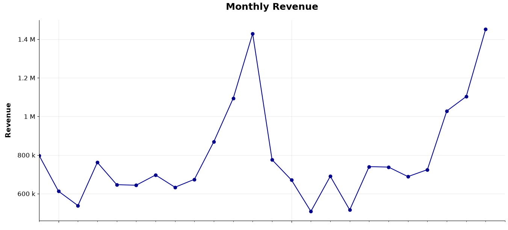
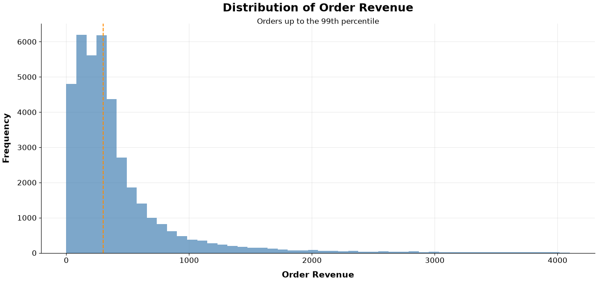
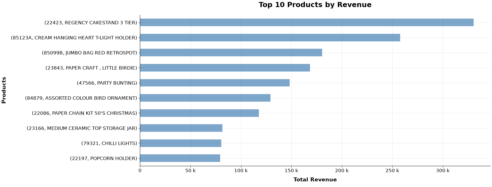
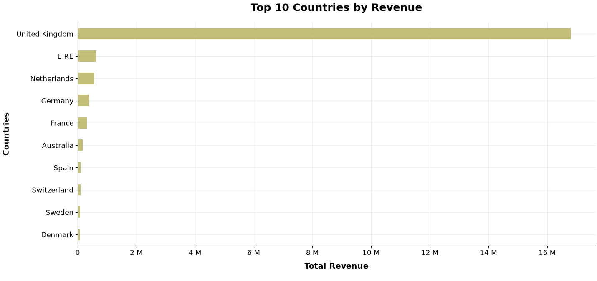

# Data Preparation Pipeline – Online Retail II

## Projektübersicht

Dieses Projekt zeigt die strukturierte Aufbereitung eines realen E-Commerce-Datensatzes mit **Python und Pandas**. Als Grundlage dient der **Online Retail II** Datensatz mit mehr als einer Million Transaktionszeilen aus zwei Jahren. Der Datensatz wurde gewählt, weil er neben seinem Umfang verschiedene Datenqualitätsprobleme und fachliche Sonderfälle enthält und sich damit gut für eine realitätsnahe Datenaufbereitung eignet.

Ziel des Projekts ist nicht eine umfassende Analyse des Unternehmens, sondern die Erstellung **bereinigter, validierter und analysefähiger Datensätze**. Welche Daten bereinigt, ausgeschlossen oder transformiert werden, wird dabei nicht allein anhand technischer Auffälligkeiten entschieden, sondern orientiert sich an der folgenden Businessfrage:

> **Wie entwickeln sich Umsatz, Absatz und Bestellstruktur regulärer Produktverkäufe im Zeitverlauf, und welche Produkte und Länder treiben diese Entwicklung?**

Die Rohdaten werden dazu zunächst untersucht und anschließend schrittweise importiert, bereinigt, validiert und transformiert. Als Ergebnis entstehen aufbereitete Parquet-Datensätze für weitere Analysen. Ergänzende Visualisierungen zeigen beispielhaft, wie sich diese Daten für die formulierte Businessfrage verwenden lassen.

## Datenaufbereitung

Die Datenaufbereitung ist in klar voneinander getrennte Schritte gegliedert. Das vorgelagerte **Data Profiling** untersucht die Rohdaten und bildet die Grundlage für die fachlichen Entscheidungen im anschließenden Cleaning.

**Data Profiling → Import → Cleaning → Transformation → Analysefähige Daten**

### Data Profiling

Vor der eigentlichen Aufbereitung werden Struktur und Qualität der Rohdaten untersucht. Dabei werden unter anderem Datentypen, fehlende Werte, Duplikate, Eindeutigkeiten sowie auffällige Rechnungen, Produkte und Buchungen betrachtet.

Das Profiling verändert die Daten nicht. Seine Ergebnisse dienen dazu, Probleme und Sonderfälle zunächst zu verstehen und anschließend bewusst zu entscheiden, wie sie im Hinblick auf die Businessfrage behandelt werden.

### Import

Die beiden Tabellenblätter des ursprünglichen Excel-Datensatzes werden eingelesen und zu einem gemeinsamen Datensatz zusammengeführt. Identifikatoren und Textinformationen werden in einheitliche Datentypen überführt und das Ergebnis im Parquet-Format gespeichert.

Damit entsteht eine einheitliche Ausgangsbasis für die weitere Verarbeitung.

### Cleaning

Das Cleaning orientiert sich an der Businessfrage und soll einen Datenbestand erzeugen, der **reguläre Produktverkäufe** abbildet. Auffällige Datensätze werden deshalb nicht pauschal entfernt, sondern anhand ihrer fachlichen Bedeutung bewertet.

Zu den wesentlichen Schritten gehören:

- Entfernen vollständig identischer Duplikate
- Ausschließen von Stornierungen
- Vereinheitlichen des Rechnungszeitpunkts
- Ausschließen administrativer Vorgänge, Gutscheine, Testbuchungen und weiterer Sonderfälle
- Behandeln von nicht regulären Mengen und Preisen
- Untersuchen und gezieltes Bereinigen von Nullpreis-Rechnungen

Die Ergebnisse wichtiger Cleaning-Schritte werden zusätzlich validiert, damit unbeabsichtigte Veränderungen des Datenbestands frühzeitig erkannt werden.

### Transformation

Der bereinigte Datensatz wird anschließend in eine analysefreundliche Struktur überführt. Dabei werden wiederkehrende Berechnungen und Informationen bereits zentral vorbereitet.

Unter anderem werden:

- eine separate Datumstabelle mit Kalendermerkmalen erstellt,
- der Umsatz je Rechnungsposition als **Revenue** berechnet,
- Rechnungsdatum und Uhrzeit getrennt bereitgestellt,
- Rechnungen und Rechnungspositionen in eigene Tabellen aufgeteilt,
- Kennzahlen wie **PositionCount**, **TotalQuantity** und **TotalRevenue** auf Rechnungsebene bereitgestellt,
- Produktbezeichnungen für die spätere Auswertung vereinheitlicht.

Das resultierende Datenmodell wird abschließend auf eindeutige Schlüssel und referenzielle Integrität geprüft. Danach werden `date.parquet`, `invoice.parquet` und `invoice_position.parquet` als analysefähige Datensätze gespeichert.

### Pipeline-Ausführung

Die drei Verarbeitungsschritte **Import → Cleaning → Transformation** können über `run_pipeline.py` zentral ausgeführt werden. Das Skript startet die zugehörigen Jupyter Notebooks mit `nbclient` automatisch in der vorgesehenen Reihenfolge. Dadurch lässt sich die komplette Datenaufbereitung reproduzierbar vom Import bis zu den transformierten Datensätzen durchlaufen.

## Ergebnis und Analysebeispiele

Die Pipeline erzeugt aus den ursprünglichen Transaktionsdaten drei aufbereitete Parquet-Datensätze für weitere Analysen:

- **date.parquet** – Kalenderinformationen für zeitbezogene Auswertungen
- **invoice.parquet** – Rechnungen mit aggregierten Kennzahlen wie `PositionCount`, `TotalQuantity` und `TotalRevenue`
- **invoice_position.parquet** – einzelne Rechnungspositionen mit Produktinformationen, Menge und berechnetem `Revenue`

Die folgenden Visualisierungen sind keine vollständige Analyse des Online-Retail-II-Datensatzes. Sie zeigen beispielhaft, wie sich die aufbereiteten Daten zur Beantwortung der zuvor formulierten Businessfrage verwenden lassen.

### Entwicklung des Umsatzes

Die aufbereiteten Datensätze können ohne weitere Bereinigung direkt für analytische Auswertungen verwendet werden. Das folgende Beispiel aggregiert den Umsatz auf Monatsebene und visualisiert seine zeitliche Entwicklung.

```python
invoice_date_merge = pd.merge(
    invoice_dataset,
    date_dataset,
    left_on="Date",
    right_index=True,
    how="inner"
)

incomplete_last_month = invoice_date_merge["YearMonth"].max()

invoice_date_merge = invoice_date_merge[
    invoice_date_merge["YearMonth"] < incomplete_last_month
]

revenue_by_yearmonth = (
    invoice_date_merge
    .groupby("YearMonth")["TotalRevenue"]
    .sum()
)

fig, axis = plt.subplots()

revenue_by_yearmonth.plot(
    ax=axis,
    title="Monthly Revenue",
    xlabel="Month",
    ylabel="Revenue",
    color="darkblue",
    marker="o"
)

axis.yaxis.set_major_formatter(EngFormatter())
axis.set_xlim(
    right=revenue_by_yearmonth.index.max()
    + pd.Timedelta(days=30)
)
```



Die monatliche Betrachtung zeigt, wie sich der Umsatz der regulären Produktverkäufe über den betrachteten Zeitraum entwickelt. Deutlich erkennbar sind dabei Schwankungen im Jahresverlauf sowie ein starker Anstieg gegen Ende des Beobachtungszeitraums.

### Verteilung der Bestellumsätze



Die Bestellumsätze sind deutlich rechtsschief verteilt: Die meisten Rechnungen weisen vergleichsweise niedrige Umsätze auf, während wenige Bestellungen erheblich höhere Werte erreichen. Damit die Verteilung der großen Mehrheit der Bestellungen in der Grafik sichtbar bleibt, werden Bestellungen bis zum 99. Perzentil dargestellt.

### Umsatzstärkste Produkte



Die umsatzstärksten Produkte unterscheiden sich deutlich in ihrem Beitrag zum Gesamtumsatz. **REGENCY CAKESTAND 3 TIER** erzielt dabei den höchsten Umsatz unter den regulären Produktverkäufen.

### Umsatzstärkste Länder



Die Umsätze verteilen sich sehr ungleich auf die betrachteten Länder. Das Vereinigte Königreich dominiert den Datensatz mit deutlichem Abstand, während die Umsätze der übrigen Länder wesentlich niedriger ausfallen.

Die Auswertung zeigt damit, aus welchen Ländern die Umsätze der regulären Produktverkäufe hauptsächlich stammen.

## Projektstruktur

```text
data-preparation-pipelines/
├── data/
│   ├── cleaned/
│   ├── imported/
│   ├── raw/
│   └── transformed/
├── images/
├── notebooks/
│   ├── 01_data_profiling.ipynb
│   └── 02_analysis_examples.ipynb
├── pipeline/
│   ├── 01_import.ipynb
│   ├── 02_cleaning.ipynb
│   └── 03_transformation.ipynb
├── src/
│   └── paths.py
├── .gitignore
├── README.md
└── run_pipeline.py 
```
Die Verzeichnisse unter `data/` bilden die einzelnen Zustände der Daten während der Aufbereitung ab. Die eigentlichen Verarbeitungsschritte befinden sich unter `pipeline/`, während `notebooks/` das vorgelagerte Data Profiling und die anschließenden Analysebeispiele enthält.

`src/paths.py` stellt die zentral verwendeten Projektpfade bereit. Mit `run_pipeline.py` können Import, Cleaning und Transformation in der vorgesehenen Reihenfolge ausgeführt werden.

## Fazit

Das Projekt zeigt den vollständigen Weg von einem umfangreichen und nicht unmittelbar analysefähigen Rohdatensatz zu strukturierten, bereinigten und validierten Daten für weitere Auswertungen.

Im Mittelpunkt stand dabei nicht das möglichst weitgehende Bereinigen der Daten, sondern die Frage, welche Informationen für die definierte Businessfrage benötigt werden und wie fachliche Sonderfälle entsprechend behandelt werden sollten. Das vorgelagerte Data Profiling bildet dafür die Entscheidungsgrundlage, während die anschließende Pipeline die notwendigen Schritte reproduzierbar umsetzt.

Die abschließenden Analysebeispiele zeigen, dass die erzeugten Datensätze für Auswertungen auf Zeit-, Bestell-, Produkt- und Länderebene unmittelbar verwendet werden können.

## Datensatz und Lizenz

Für dieses Projekt wird der Datensatz [**Online Retail II**](https://archive.ics.uci.edu/dataset/502/online+retail+ii) von **Daqing Chen** aus dem UCI Machine Learning Repository verwendet.

- **Quelle:** UCI Machine Learning Repository
- **Autor:** Daqing Chen
- **Lizenz:** [Creative Commons Attribution 4.0 International (CC BY 4.0)](https://creativecommons.org/licenses/by/4.0/)
- **DOI:** [10.24432/C5CG6D](https://doi.org/10.24432/C5CG6D)